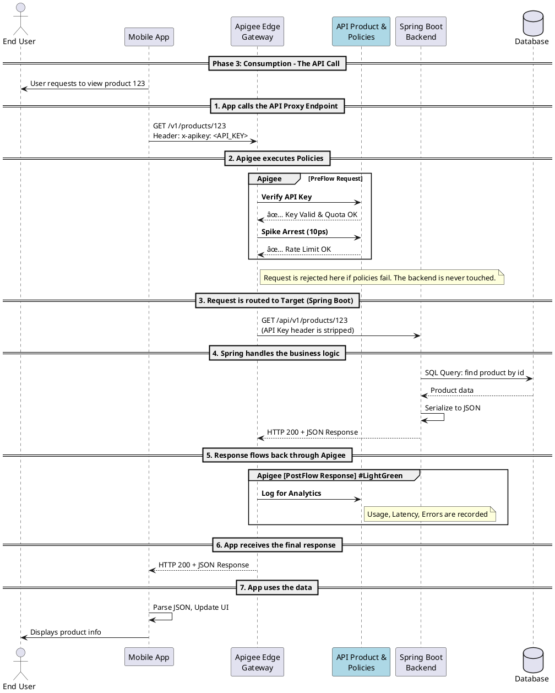

# APIGEE 

## APIGEE - what , when , how and why of things

Of course. Let's break down Apigee using the What, When, How, and Why framework.

---

1. What is Apigee?

Apigee (now officially Google Cloud Apigee) is a full-featured, multi-cloud API management platform. It provides tools and infrastructure for the entire API lifecycle—from design, development, and security to analytics, monetization, and developer engagement.

Think of it as the "central nervous system" for your API ecosystem. It sits as a layer between your backend services (the "things that do the work") and the clients that consume them (apps, websites, partners), managing all the cross-cutting concerns.

Key Components:

· API Gateway: The core runtime component that proxies API requests, enforces security, and executes policies.
· Developer Portal: A customizable website (often self-service) where developers can discover, learn about, and sign up to use your APIs.
· Analytics: Provides deep insights into API performance, usage patterns, error rates, and consumer behavior.
· Monetization: Allows you to package APIs into products, set up rate plans, and generate revenue from your API offerings.

---

2. Why Use Apigee? (The Value Proposition)

Companies adopt Apigee to solve critical business and technical challenges:

· Abstraction & Decoupling: Apigee acts as a facade. Your backend services can change, be rewritten, or be replaced without breaking the external contract that your app developers rely on. This protects your consumers from internal changes.
· Security: It provides a robust, centralized point to enforce security policies like API key validation, OAuth 2.0 / JWT tokens, threat protection (e.g., XML/JSON bombs, SQL injection), and mutual TLS (mTLS).
· Control & Governance: You can enforce usage quotas, rate limits (to prevent abuse and manage traffic spikes), and apply custom logic (like data transformation, mediation between XML/JSON) without touching your backend code.
· Analytics & Business Insights: Understand how your APIs are being used. Which ones are most popular? Who are your top consumers? Where are errors occurring? This data is crucial for making informed product decisions.
· Monetization: If your business model involves charging for API access, Apigee provides the tools to create rate plans, generate bills, and track revenue.
· Developer Ecosystem: The developer portal fosters a community around your APIs, making it easy for internal or external developers to onboard and build applications.

---

3. How Does Apigee Work? (The Mechanics)

At its simplest, Apigee works by intercepting API calls, applying policies, and then routing them to the appropriate backend.

The Basic Flow:

1. Publish: An API developer defines an API proxy in Apigee. This proxy is a mapping to one or more backend services (called "targets").
2. Call: A client application (e.g., a mobile app) makes an HTTP request to the Apigee API proxy endpoint (e.g., https://mycompany.apigee.net/v1/orders) instead of calling the backend directly.
3. Process (The "Proxy" Part): The API Gateway receives the request and executes a predefined sequence of steps in a "proxy pipeline":
   · PreFlow: Policies applied on the request before it is routed to the target. (e.g., Verify API Key, Spike Arrest for rate limiting, JSON Threat Protection).
   · Target Endpoint: The request is sent to the actual backend service (e.g., a Java microservice, a legacy system).
   · PostFlow: Policies applied on the response after it comes back from the target but before it is sent to the client. (e.g., XML-to-JSON Transformation, Remove Headers to hide internal info).
4. Respond: The transformed and secured response is sent back to the client app.
5. Analyze: Apigee logs the entire transaction for analytics and monitoring.

Example Policy (Snippet): A policy to verify an API key is attached to the preflow. It's an XML configuration that Apigee understands:

```xml
<!-- This is a simplified example -->
<VerifyAPIKey async="false" continueOnError="false" enabled="true" name="Verify-API-Key">
    <APIKey ref="request.queryparam.apikey"/> <!-- Looks for the key in the query string -->
</VerifyAPIKey>
```

---

4. When to Use Apigee? (Ideal Use Cases)

Apigee is a powerful (and enterprise-grade) platform, so it's best suited for specific scenarios:

· Building a Public API Program: When you want to expose your services to external partners or third-party developers to build an ecosystem around your platform (e.g., Twilio, Stripe).
· Digital Transformation: When modernizing legacy applications by wrapping them with a modern, well-designed API layer, allowing them to be consumed by new mobile and web apps.
· Multi-Channel Strategy: When you have multiple client types (iOS, Android, Web, Smart Devices) that all need to consume the same backend services consistently and securely.
· Microservices Governance: In a microservices architecture, Apigee can act as a North-South Gateway (or API Gateway), handling external traffic, security, and composition for a large number of internal microservices.
· Monetizing Digital Assets: When you have data or services that other businesses are willing to pay for on a usage-based or subscription model.
· Complex Security & Compliance Needs: When you need a centralized, robust system to enforce OAuth, quotas, and threat protection, especially across multiple teams and APIs.

When Not to Use Apigee?

· For very simple, internal-only APIs with no need for analytics, security, or versioning.
· When the primary need is for East-West traffic (service-to-service communication inside a network). A service mesh (like Istio) is often a better fit for this.
· For projects with extremely tight budgets, as Apigee is a premium product with significant licensing costs.

---

### Summary

Aspect Description
What A comprehensive API management platform by Google Cloud for the full API lifecycle.
Why To secure, control, analyze, and monetize APIs, enabling digital transformation and building developer ecosystems.
How By acting as a reverse proxy that intercepts API calls, applies policies (security, mediation), and routes to backends.
When Ideal for public API programs, microservices north-south traffic, monetization, and complex enterprise governance.

## A complete journey of publishing, subscribing and consuming an API with the real world Springboot application

Of course. Here is a complete, real-world journey of publishing, subscribing, and consuming an API using Spring Boot as the backend service and Google Cloud Apigee as the API management layer.

We'll use a simple but practical example: a Product API.

---

The Cast & Setup

1. API Provider (Us): A company with a Spring Boot application that has a Product service.
2. API Consumer (A Partner/App Developer): An external developer who wants to use our product data in their mobile app.
3. Spring Boot Application: Our backend service running locally or on a cloud like GCP, AWS, etc.
   · Endpoint: http://our-spring-app.com/api/v1/products
   · Controller:
     ```java
     @RestController
     @RequestMapping("/api/v1/products")
     public class ProductController {
     
         @GetMapping
         public List<Product> getAllProducts() {
             // ... logic to get products from a database
             return productService.findAll();
         }
     
         @GetMapping("/{id}")
         public Product getProductById(@PathVariable Long id) {
             // ... logic to get a specific product
             return productService.findById(id).orElseThrow(() -> new ProductNotFoundException(id));
         }
     }
     ```
4. Apigee: The API management platform we will use. We assume an organization is already set up.

---

Phase 1: Publishing the API in Apigee

This is what we, the API provider, do to expose our Spring Boot API securely through Apigee.

Step 1: Create an API Proxy

We create a proxy in Apigee that will represent our Spring Boot Product API.

· Action: In the Apigee UI, we go to Develop -> API Proxies -> Create New.
· Name: product-service-v1
· Proxy Type: We choose Reverse Proxy.
· Target Service: We enter the base URL of our Spring Boot application: http://our-spring-app.com. This is the crucial link; Apigee now knows where to send requests.
· Paths: We set the base path for the proxy, e.g., /v1/products.

Result: Apigee generates a new proxy endpoint like: https://your-org-name-environment.apigee.net/v1/products

This URL is now the face of our API. Clients will call this, not our Spring Boot URL directly.

Step 2: Configure Policies (The "Why" of Apigee)

We add policies to the Proxy to manage traffic, secure access, and transform data. We edit the proxy's PreFlow in the request pipeline.

· Policy 1: Verify API Key
  · Why: To identify the app making the call. This is the simplest form of authentication.
  · How: We attach an Verify API Key policy. This policy checks for a valid key, usually passed in the x-apikey header.
· Policy 2: Spike Arrest
  · Why: To protect our Spring Boot backend from traffic spikes and denial-of-service attacks.
  · How: We add a Spike Arrest policy to limit traffic to, say, 10 requests per second.

What the Proxy Flow Looks Like Now:

1. Request comes to https://your-org.apigee.net/v1/products/123
2. PreFlow: Apigee executes the Verify API Key and Spike Arrest policies.
3. If the key is invalid or the rate limit is breached, Apigee immediately rejects the request and never calls our Spring backend. This is a huge win for security and performance.
4. If policies pass, the request is routed to the target: http://our-spring-app.com/api/v1/products/123.
5. The Spring application processes the request and returns a response.
6. The response flows back through Apigee to the client.

Step 3: Create an API Product

An API Product in Apigee is a bundle of API proxies (or specific paths) that we want to sell or offer as a plan.

· Action: In the Apigee UI, we go to Publish -> API Products -> Create.
· Name: ProductCatalog-Basic
· Environment: test or prod
· Access: We add the product-service-v1 proxy and specify the paths we want to expose (e.g., /v1/products/**).
· Quotas: We set a quota, e.g., 1000 requests per day for the basic plan.

This API Product is the package that developers will subscribe to.

Step 4: Create a Developer Portal

We use Apigee's built-in tools to create a portal (a website) where developers can:

· Discover our ProductCatalog-Basic API product.
· Read the automatically generated documentation for our endpoints.
· Sign up to get access.

We publish the API Product to this portal.

---

Phase 2: Subscribing to the API (The Consumer's Journey)

This is what our partner, the mobile app developer, does to get access.

Step 1: Discover and Sign Up

1. The developer goes to our Developer Portal URL (e.g., dev.mycompany.com).
2. They browse the available APIs and find the ProductCatalog-Basic product.
3. They click "Sign Up" or "Register" on the portal, creating a developer account.

Step 2: Register an App and Get Credentials

1. In their developer account, they create a new "App." They might name it MobileShoppingApp.
2. When creating the app, they select which API Products it needs access to (in this case, ProductCatalog-Basic).
3. Upon registering the app, the portal automatically generates a unique API Key for that app. This key is the secret token that identifies the MobileShoppingApp.

The consumer now has their key and is ready to make calls.

---

Phase 3: Consuming the API (The Real-World Call)

Now, let's see the complete flow from the mobile app to the Spring backend and back.

Step 1: The Mobile App Makes a Call

The developer codes their mobile app to call the Apigee endpoint, adding the API key to the header.

HTTP Request from the Mobile App:

```http
GET /v1/products/123 HTTP/1.1
Host: your-org-test.apigee.net
x-apikey: A12ZYX3B4C5D6E7F8G9H0 // The API Key for 'MobileShoppingApp'
User-Agent: MobileShoppingApp/1.0
```

Step 2: Apigee Processes the Request

1. Receive: Apigee receives the request at its gateway.
2. Verify: The Verify API Key policy springs into action. It takes the key A12ZYX3B4C5D6E7F8G9H0 and checks:
   · Is this a valid key issued by Apigee? Yes.
   · Is the key associated with an approved app that is subscribed to the ProductCatalog-Basic product? Yes.
   · Has the app's daily quota of 1000 requests been exceeded? No.
3. Route: All checks pass. Apigee strips the x-apikey header (so it never reaches your backend) and transforms the URL. The request is now sent to the pre-configured target:
   · Original URL: https://your-org.apigee.net/v1/products/123
   · Transformed Target URL: http://our-spring-app.com/api/v1/products/123

Step 3: The Spring Backend Responds

Our Spring Boot application receives what looks like a normal HTTP request. It is completely unaware of Apigee. It processes the request, queries the database for product ID 123, and returns a JSON response.

HTTP Response from Spring Boot:

```http
HTTP/1.1 200 OK
Content-Type: application/json

{
  "id": 123,
  "name": "Wireless Headphones",
  "price": 99.99,
  "inStock": true
}
```

Step 4: Apigee Processes the Response

The response flows back through Apigee. We could add policies here (e.g., to filter out the price field for certain plans), but in this case, it just logs the transaction for analytics and sends the response back.

Step 5: The Mobile App Receives the Data

The mobile app gets the clean JSON response and displays the product information to the user. The journey is complete.

```json
{
  "id": 123,
  "name": "Wireless Headphones",
  "price": 99.99,
  "inStock": true
}
```

---

Summary of the End-to-End Flow

Step Actor Action Technology
1. Publish Us (Provider) Create Proxy, Policies, and Product in Apigee. Apigee UI/API
2. Expose Us (Provider) Document the API on the Developer Portal. Apigee Portal
3. Discover Consumer Finds our API Product on the portal. Portal Website
4. Subscribe Consumer Registers an App to get an API Key. Portal Website
5. Call Consumer's App Sends request to Apigee URL with API Key. Mobile App Code
6. Protect Apigee Verifies Key, Checks Quota & Rate Limits. Apigee Policies
7. Route Apigee Forwards valid request to Spring Boot backend. Apigee Proxy
8. Process Spring Boot Handles the business logic and returns data. @RestController
9. Analyze Apigee Logs the transaction for monitoring. Apigee Analytics
10. Consume Consumer's App Receives data and uses it. Mobile App UI

This seamless integration allows the Spring Boot team to focus on business logic (building great product services) while the API team (or platform team) uses Apigee to handle global concerns like security, governance, and analytics.

## A visual illustration using an ASCII diagram and/or a PlantUML that will add more clarity and better insights into the E2E flow

Of course. Here is a visual illustration of the complete end-to-end flow using a combination of ASCII and PlantUML diagrams.

The journey is broken down into two key diagrams:

1. Architectural Overview (ASCII): A static map of all components.
2. Sequence Diagram (PlantUML): A dynamic view of the API call flow.

---

1. Architectural Overview (ASCII Diagram)

This diagram shows the "cast of characters" and how they are connected before any call is made.

```
+-----------------------------------------------------------------------+
|                        API PROVIDER (Our Company)                     |
|                                                                       |
|  +---------------------+          +-------------------------------+   |
|  |   Spring Boot       |          |        Google Cloud Apigee    |   |
|  |   Backend Service   |<---------|                               |   |
|  |                     |  Target  |  +-------------------------+  |   |
|  | - Business Logic    |  Call    |  |      API Proxy          |  |   |       +-----------------------+
|  | - Database          |          |  |  - product-service-v1   |  |   |       |                       |
|  | - /api/v1/products  |          |  |  - Policies:            |  |   |       |  API CONSUMER         |
|  +---------------------+          |  |    * Verify API Key     |  |   |       |  (Mobile App Dev)     |
|                                   |  |    * Spike Arrest       |  |   |       |                       |
|  "The Source of Truth"            |  +-------------------------+  |   |       |  +-----------------+  |
|                                   |                               |   |       |  |  Developer      |  |
|                                   |  +-------------------------+  |   |       |  |  Portal         |  |
|                                   |  |     API Product         |  |   |       |  |  - Discover API |  |
|                                   |  |  - ProductCatalog-Basic |  |   |<------|  |  - Register App |  |
|                                   |  |  - Quota: 1000/day      |  |   |       |  |  - Get API Key  |  |
|                                   |  +-------------------------+  |   |       |  +-----------------+  |
|                                   |                               |   |       |                       |
|                                   +-------------------------------+   |       |  "Gets Credentials"   |
|                                                                       |       +-----------------------+
+-----------------------------------------------------------------------+

                               ^
                               |  API Call (with API Key)
                               |
+-----------------------+      |
|                       |      |
|  API CONSUMER         |------+
|  (Mobile App)         |         https://my-company.apigee.net/v1/products/123
|                       |         Header: x-apikey: A12ZYX3B4C5D6E7F8G9H0
|  - Makes API Call     |
|  - Uses API Key       |
|  - Processes Data     |
|                       |
+-----------------------+
            |
            |  (Displays Info)
            v
      +-------------+
      |   End-User  |
      |   (Customer)|
      +-------------+
```

---

2. Dynamic API Call Flow (PlantUML Sequence Diagram)

This diagram details the exact sequence of events when the mobile app makes a call. This is the most important part for understanding the "how".

PlantUML Code (You can render this at planttext.com):



Rendered Visual Flow (Description of the PlantUML Diagram):

The sequence diagram visually shows the following critical insights:

1. The Consumer is Decoupled: The Mobile App only knows about the Apigee endpoint, not the internal Spring Boot URL.
2. Policies are Enforced Early: Security (API Key Verification) and Protection (Spike Arrest) happen before the request ever reaches your precious Spring Boot backend. This is the primary value of the API Gateway.
3. Backend is Unaware: The Spring Boot application receives a clean, standard HTTP request. It has no knowledge of API keys, quotas, or Apigee. It just does its job.
4. Analytics are Automatic: The response is logged on its way back out, providing immediate visibility into API usage and performance without any extra code in your Spring app.
5. The End-User Experience: The entire complex journey is completed in milliseconds, resulting in a seamless experience for the end-user.

This combination of architecture map and sequence flow provides a complete picture of the "what", "how", and "why" of the API journey with Spring Boot and Apigee.

Of course. Here is a visual illustration of the complete end-to-end flow using a combination of ASCII and PlantUML diagrams.

The journey is broken down into two key diagrams:

1. Architectural Overview (ASCII): A static map of all components.
2. Sequence Diagram (PlantUML): A dynamic view of the API call flow.

---

1. Architectural Overview (ASCII Diagram)

This diagram shows the "cast of characters" and how they are connected before any call is made.

```
+-----------------------------------------------------------------------+
|                        API PROVIDER (Our Company)                     |
|                                                                       |
|  +---------------------+          +-------------------------------+   |
|  |   Spring Boot       |          |        Google Cloud Apigee    |   |
|  |   Backend Service   |<---------|                               |   |
|  |                     |  Target  |  +-------------------------+  |   |
|  | - Business Logic    |  Call    |  |      API Proxy          |  |   |       +-----------------------+
|  | - Database          |          |  |  - product-service-v1   |  |   |       |                       |
|  | - /api/v1/products  |          |  |  - Policies:            |  |   |       |  API CONSUMER         |
|  +---------------------+          |  |    * Verify API Key     |  |   |       |  (Mobile App Dev)     |
|                                   |  |    * Spike Arrest       |  |   |       |                       |
|  "The Source of Truth"            |  +-------------------------+  |   |       |  +-----------------+  |
|                                   |                               |   |       |  |  Developer      |  |
|                                   |  +-------------------------+  |   |       |  |  Portal         |  |
|                                   |  |     API Product         |  |   |       |  |  - Discover API |  |
|                                   |  |  - ProductCatalog-Basic |  |   |<------|  |  - Register App |  |
|                                   |  |  - Quota: 1000/day      |  |   |       |  |  - Get API Key  |  |
|                                   |  +-------------------------+  |   |       |  +-----------------+  |
|                                   |                               |   |       |                       |
|                                   +-------------------------------+   |       |  "Gets Credentials"   |
|                                                                       |       +-----------------------+
+-----------------------------------------------------------------------+

                               ^
                               |  API Call (with API Key)
                               |
+-----------------------+      |
|                       |      |
|  API CONSUMER         |------+
|  (Mobile App)         |         https://my-company.apigee.net/v1/products/123
|                       |         Header: x-apikey: A12ZYX3B4C5D6E7F8G9H0
|  - Makes API Call     |
|  - Uses API Key       |
|  - Processes Data     |
|                       |
+-----------------------+
            |
            |  (Displays Info)
            v
      +-------------+
      |   End-User  |
      |   (Customer)|
      +-------------+
```

---

2. Dynamic API Call Flow (PlantUML Sequence Diagram)

This diagram details the exact sequence of events when the mobile app makes a call. This is the most important part for understanding the "how".

PlantUML Code (You can render this at planttext.com):


Rendered Visual Flow (Description of the PlantUML Diagram):

The sequence diagram visually shows the following critical insights:

1. The Consumer is Decoupled: The Mobile App only knows about the Apigee endpoint, not the internal Spring Boot URL.
2. Policies are Enforced Early: Security (API Key Verification) and Protection (Spike Arrest) happen before the request ever reaches your precious Spring Boot backend. This is the primary value of the API Gateway.
3. Backend is Unaware: The Spring Boot application receives a clean, standard HTTP request. It has no knowledge of API keys, quotas, or Apigee. It just does its job.
4. Analytics are Automatic: The response is logged on its way back out, providing immediate visibility into API usage and performance without any extra code in your Spring app.
5. The End-User Experience: The entire complex journey is completed in milliseconds, resulting in a seamless experience for the end-user.

This combination of architecture map and sequence flow provides a complete picture of the "what", "how", and "why" of the API journey with Spring Boot and Apigee.

## Explanation on Proxies , and authentication

Of course. Let's break down the core concepts of Proxies and Authentication in the context of API management (like Apigee), moving from simple analogies to technical specifics.

---

1. Proxies: The Strategic Middleman

What is a Proxy? (The Simple Analogy)

Imagine you're a famous author. Fans want to send you letters, but you don't want to give out your home address. Instead, you rent a P.O. Box at the local post office.

· You are the backend service (the real, private address).
· The P.O. Box is the API proxy (the public, safe address).
· The Post Office is the API gateway (Apigee).

The post office (gateway) receives all mail for the P.O. Box (proxy), checks it for hazards (security policies), and then forwards the safe letters to your home address (the backend).

Technical Definition & Why It's Powerful

In API management, a proxy is an intermediary software component that sits between a client (e.g., a mobile app) and a backend service (e.g., your Spring Boot app). It acts as a facade, representing one or more backend services.

The "Why": The Key Benefits of Using a Proxy

Benefit Analogy Technical Implementation
Abstraction & Decoupling You can move to a new house without telling your fans; you just update your forwarding address at the post office. The client only knows the proxy's URL. You can completely rewrite your backend, change its programming language, or move it to a new server without breaking the client.
Security The post office screens packages for bombs, anthrax, or junk mail before you ever see them. The proxy enforces security policies (API keys, OAuth tokens, threat scanning for SQL injection) before the request hits your vulnerable backend.
Traffic Control The post office can limit how many letters you receive per day to prevent you from being overwhelmed. The proxy enforces rate limiting, quotas, and spike arrest to protect your backend from being flooded by too many requests (either accidental or malicious).
Mediation & Transformation The post office could translate a letter from French to English before delivering it to you. The proxy can transform message formats (e.g., XML to JSON), add/remove headers, or even combine calls to multiple backends into a single response for the client.
Monitoring & Analytics The post office keeps logs of all mail sent and received. The proxy automatically logs every API call, providing crucial data on who is calling what, how often, how fast it responds, and how often it fails.

In the Apigee Context: When you create an "API Proxy," you are essentially creating this P.O. Box. You configure:

· Proxy Endpoint: The public URL that clients call (e.g., https://mycompany.apigee.net/v1/products).
· Target Endpoint: The private, internal URL of your backend service (e.g., http://my-spring-app.internal.com/api/products).

---

2. Authentication: Proving Your Identity

What is Authentication? (The Simple Analogy)

Authentication is the process of proving you are who you say you are. It's like:

· Showing your ID to a bouncer at a club.
· Using a key to unlock your front door.
· Entering a password to log into your email.

In the API world, it's about proving that an application (a client) has the right to access a specific API.

Technical Mechanisms in API Proxies

APIs use standardized methods to handle authentication. The proxy is the "bouncer" that enforces these methods.

1. API Keys (The Name Tag)

· What it is: A long, cryptographically random string (e.g., A12ZYX3B4C5D6E7F8G9H0) that is issued to a specific application.
· How it works: The client sends the key in the HTTP request, usually in a header like x-apikey.
· Proxy's Job: Apigee checks if the key is valid, not revoked, and associated with an app that has access to the requested API product.
· Analogy: A pre-shared secret handshake or a concert wristband. It's simple but not super secure if intercepted.
· Use Case: Identifying an application for basic access control and analytics. Best for low-risk scenarios or as one part of a larger security strategy.

2. OAuth 2.0 / Access Tokens (The Temporary Keycard)

· What it is: A framework for issuing short-lived access tokens instead of static keys.
· How it works:
  1. The application (client) redirects a user to a login page (managed by Apigee or an identity provider like Google).
  2. The user enters their credentials (username/password).
  3. If successful, the application receives a short-lived access token (a JWT - JSON Web Token).
  4. The client sends this token in the Authorization: Bearer <token> header.
· Proxy's Job: Apigee validates the JWT: Is it signed correctly? Is it expired? What scopes (permissions) does it contain?
· Analogy: A temporary keycard for a hotel room. It works for a set period and only for the room you were assigned. It's much safer than a static key.
· Use Case: Authorizing users and applications for specific actions. Essential for accessing user-specific data and for higher-security applications. This is the modern standard.

3. Mutual TLS (mTLS) (The Digital Passport)

· What it is: A two-way SSL handshake where both the client and the server (proxy) prove their identity using digital certificates.
· How it works: The client presents its certificate to the proxy, and the proxy verifies it against a trusted list. The proxy also presents its certificate to the client.
· Proxy's Job: Apigee performs the cryptographic handshake and validation, ensuring the client is a known, trusted entity.
· Analogy: Not just checking someone's ID, but also having them provide a government-verified passport that's extremely hard to forge. This is high-trust, machine-to-machine (M2M) authentication.
· Use Case: Securing highly sensitive communications between known backend systems (e.g., microservices) or with trusted partners.

How They Work Together in Apigee: A Summary

The following PlantUML sequence diagram shows how a proxy handles different authentication methods, which is its primary job as a gatekeeper.

View this diagram at planttext.com:

```plantuml
@startuml
title API Proxy: The Authentication Gatekeeper

actor "Client App" as Client
participant "Apigee Proxy" as Apigee
database "Validation\nRegistry" as Registry

== Scenario 1: API Key Authentication ==

Client -> Apigee: GET /api/resource\nx-apikey: ABC123XYZ
Apigee -> Registry: Validate API Key "ABC123XYZ"
Registry --> Apigee: ✅ Valid, App: Mobile-App-01
Apigee -> Apigee: Check Quota & Rate Limits
Apigee --> Client: ✅ 200 OK (Access Granted)

--

== Scenario 2: OAuth 2.0 (JWT) Authentication ==

Client -> Apigee: GET /api/resource\nAuthorization: Bearer <JWT_Token>
Apigee -> Apigee: **Decode & Verify JWT**\n- Signature? ✅\n- Expired? âŒ\n- Scope? read_data ✅
Apigee --> Client: ✅ 200 OK (Access Granted)

--

== Scenario 3: Failed Authentication ==

Client -> Apigee: GET /api/resource\nx-apikey: INVALID_KEY
Apigee -> Registry: Validate API Key "INVALID_KEY"
Registry --> Apigee: ⌠Key Not Found
Apigee --> Client: 🚫 **401 Unauthorized**

@enduml
```

Key Takeaway: The proxy is the strategic choke point where authentication (and authorization) is enforced. It centralizes security logic, protecting your backend services from having to implement these complex and critical checks themselves. This makes your system more secure, manageable, and scalable.
